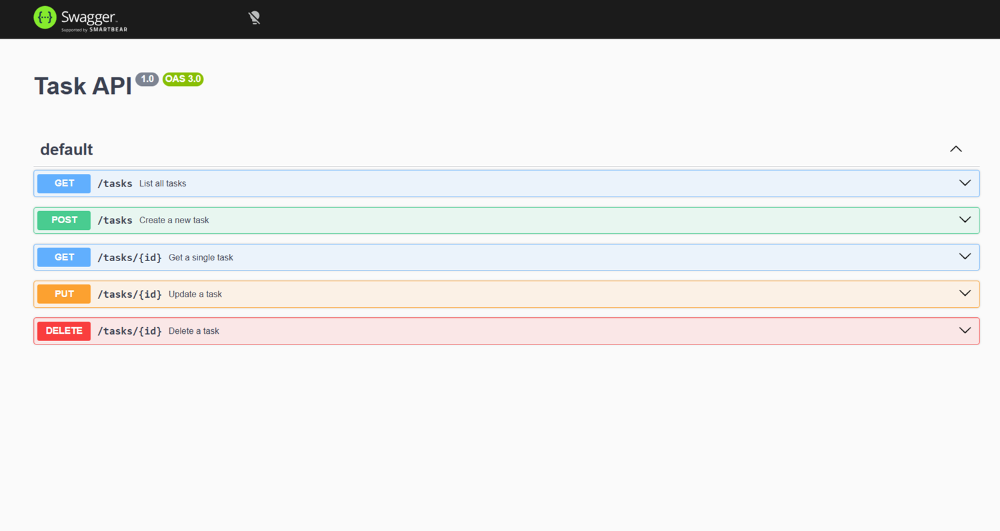

# Task API

A small CRUD API for managing a to-do list, built with **Node.js** and **Express**. Data is stored **in memory** (a plain JavaScript array) — there is no database yet, so all tasks are lost when the server restarts. This is intentional for this stage of the project.

## What this project does

The API supports full CRUD (Create, Read, Update, Delete) on a list of tasks. Each task has:

- `id` (number) — assigned automatically by the server
- `title` (string) — required, cannot be empty
- `done` (boolean) — defaults to `false` when a task is created

## Tech stack

- **Node.js** — JavaScript runtime that runs the server
- **Express** — web framework handling routing, requests, and responses
- **swagger-ui-express** — serves interactive API documentation at `/docs`

## How to run it

1. Clone this repository:
```powershell
   git clone https://github.com/G-Bharat-Sai/ToDo-API.git
   cd ToDo-API
```

2. Install dependencies:
```powershell
   npm install
```

3. Start the server:
```powershell
   node server.js
```

4. The API is now running at `http://localhost:3000`. Interactive docs are at `http://localhost:3000/docs`.

## Endpoints

| Method | Path | Description | Success | Errors |
|---|---|---|---|---|
| GET | `/` | Describes the API (name, version, endpoints) | 200 | — |
| GET | `/health` | Health check — confirms the server is running | 200 | — |
| GET | `/tasks` | Returns the full list of tasks | 200 | — |
| GET | `/tasks/:id` | Returns a single task by id | 200 | 404 if id doesn't exist |
| POST | `/tasks` | Creates a new task. Body: `{ "title": "string" }` | 201 | 400 if title is missing/empty |
| PUT | `/tasks/:id` | Updates a task's `title` and/or `done`. Body: `{ "title"?: "string", "done"?: boolean }` | 200 | 400 if title is empty, 404 if id doesn't exist |
| DELETE | `/tasks/:id` | Deletes a task by id | 204 (no body) | 404 if id doesn't exist |

## How the code is organized

Everything lives in `server.js` — small enough for this stage of the project not to need multiple files. Reading top to bottom:

1. **Setup** — imports Express and `swagger-ui-express`, creates the `app`, and registers `express.json()` middleware so incoming JSON request bodies are automatically parsed into `req.body`.
2. **Data** — a single in-memory array, `tasks`, pre-filled with 3 example tasks. This is the "database" for now.
3. **Routes** — one block per endpoint, each following the same shape:
   - Read the request (`req.params.id` for the URL's id, `req.body` for POST/PUT data)
   - Validate anything the client sent, returning `400` with a JSON error if it's invalid
   - Look up the task, returning `404` with a JSON error if it doesn't exist
   - Perform the actual work (read/create/update/delete)
   - Send back the right status code and body
4. **Swagger UI** — `openapi.json` describes every endpoint (paths, methods, expected bodies, possible responses). `swagger-ui-express` reads that file and serves an interactive page at `/docs` where each endpoint can be tested with a "Try it out" button.
5. **Server start** — `app.listen(PORT, ...)` starts the server listening on port 3000.

### A couple of implementation details worth knowing

- **Task ids** are generated with `Math.max(...tasks.map(t => t.id)) + 1` rather than `tasks.length + 1`. This avoids id collisions after a task has been deleted (using `.length` alone can reassign an id that still belongs to an existing task).
- **PUT updates are partial** — sending just `{ "done": true }` only changes `done`, leaving `title` untouched. Each field is checked individually with `!== undefined` before being applied.
- **DELETE returns 204 with no body** — this is the correct HTTP convention for "the action succeeded, there's nothing more to say."

## Example request

```powershell
curl -i http://localhost:3000/tasks/1
```
```
HTTP/1.1 200 OK
Content-Type: application/json; charset=utf-8
{"id":1,"title":"Buy milk","done":false}

```
## Swagger UI

All endpoints, viewable and testable at `http://localhost:3000/docs`:



## A note on in-memory storage

Restarting the server resets `tasks` back to the original 3 example items — any tasks created, updated, or deleted during a session are lost. This is a deliberate limitation at this stage of the project; persistent storage (a database) is planned for the following stage of the assignment.